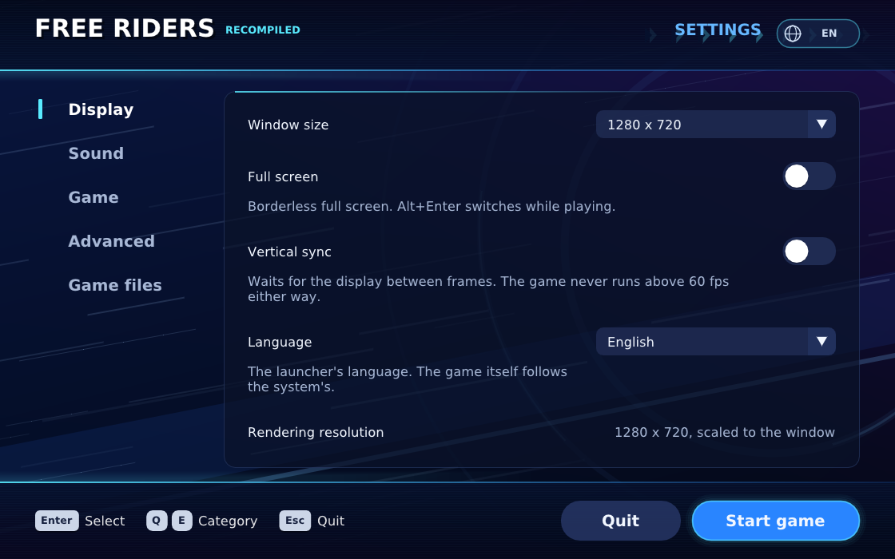

# Free Riders Recompiled

[English](README.md)

Free Riders Recompiled 是以靜態重編譯製作的 Xbox 360 版《Sonic Free Riders》非官方移植，
支援 Windows、Linux 與 Android。遊戲的 PowerPC 程式碼經
[XenonRecomp](https://github.com/hedge-dev/XenonRecomp) 轉成 C++，Xenos 著色器經
[XenosRecomp](https://github.com/sonicnext-dev/XenosRecomp) 轉換，再由原生執行期代替主機的
核心、繪圖、音效、輸入與 Kinect。

**本專案不包含任何遊戲素材。遊玩需要你自己合法取得的遊戲（美版／歐版光碟）：**啟動器會從
你的光碟映像檔安裝遊戲資料。預先建置的版本在
[Releases](https://github.com/YuutaTsubasa/Free-Riders-Recompiled/releases) 頁面；想自己建置，
見[建置說明](docs/building.md)（英文）。

> [!IMPORTANT]
> 仍在開發中。遊戲可以啟動、選單可以操作、比賽可以遊玩，但許多部分尚未測試，可能會停止或
> 出現異常。



## 目前狀態

已經可以：

- 從標題畫面經選單進入比賽：Free Race 從開始到結算；Grand Prix 從劇情進入第一場比賽。
- Direct3D 12 與 Vulkan 繪圖，著色器在遊戲遇到時即時轉換；音效；紀錄的儲存與讀取。
- 不需要 Kinect：Kinect 由程式模擬。按鍵代替選單能聽懂的語音指令，手把驅動比賽讀取的
  身體動作（傾斜、跳躍、踢地加速、抓取、特技）。
- 各平台都有啟動器：從光碟映像檔安裝遊戲並保存設定，支援英文與繁體中文（右上角可切換）。
- Linux（Vulkan、SDL2），以及 Android（arm64-v8a）的觸控按鈕與傾斜轉彎。

已知限制：

- 只支援美版／歐版光碟。
- 遊戲大部分內容尚未完整遊玩過；上述以外的關卡與模式可能停在執行期還沒做到的地方。
- Linux 與 Android 使用事先在 Windows 上轉換好的著色器（`shaders.pack`，發布版已附）。遊戲會
  在開機時建立全部 468 個著色器，因此在 Windows 上執行一次就能收集完整。
- Android 已在模擬器與一台 Adreno 750 掌機上試過。
- Android 目前只在模擬器上執行過，尚未在實機上測試。

開發紀錄在 [docs/](docs/)，從 [docs/progress.md](docs/progress.md) 開始。

## 系統需求

- **Windows**：Windows 10 或 11（x64），支援 AVX 的 CPU，支援 Direct3D 12（或 Vulkan 1.2）的
  顯示卡。
- **Linux**：支援 AVX 的 x86-64 與 Vulkan 1.2 驅動程式（在 Ubuntu 22.04 上測試）。
- **Android**：Android 9 以上、arm64-v8a、Vulkan 1.1；安裝需約 2 GB 可用空間。
- 建置所需工具見 [docs/building.md](docs/building.md)。

## 安裝

1. 從 [Releases](https://github.com/YuutaTsubasa/Free-Riders-Recompiled/releases) 下載對應系統
   的版本：Windows 的 zip、Linux 的 tar.gz，或 Android 的 APK。
2. 解壓縮到一個獨立的資料夾（Android 則安裝 APK）。
3. 執行 `FreeRidersRecompiled`，在啟動器要求時選擇你的光碟映像檔（`.iso`），它會把遊戲資料
   複製到旁邊。然後按 **開始遊戲**。

## 建置

Windows 的簡短步驟：

```powershell
python scripts/bootstrap.py
./scripts/build_tools.ps1
python scripts/rom_tool.py extract --iso "你的光碟.iso" --output private/game --path default.xex
python scripts/prepare_recomp.py
./scripts/build_shader_translator.ps1
./scripts/build_tools.ps1 -Diagnostic
./out/build/host/FreeRidersRecompiled.exe
```

第一次執行時，啟動器會要求選擇光碟映像檔，並把遊戲安裝在它旁邊。Linux 與 Android 的建置，
以及每一步的作用，見 [docs/building.md](docs/building.md)；平台細節見
[docs/linux.md](docs/linux.md)、[docs/android.md](docs/android.md)。

## 操作

| 動作 | 鍵盤 | 手把 |
| --- | --- | --- |
| 選單：移動／轉動選單圓環 | 方向鍵 | 十字鍵 |
| 確定（說「OK」） | Z 或空白鍵 | A／✕ |
| 返回 | Esc、X 或 Backspace | B／○ |
| BACK | Tab | BACK／Share |
| 開始、暫停 | Enter | START |
| 比賽：傾斜轉彎 | 方向鍵 | 左類比 |
| 蹲下（按住）、跳躍（放開） | Z 或空白鍵 | A |
| 踢地加速 | C | X |
| 煞車、抓取 | X | B |
| 切換站姿 | V | Y |
| 使用／搖晃道具 | F | RT |
| 招式 | Q／E | LB／RB |
| 手部游標（只認 Kinect 的選單） | I J K L | 右類比 |

Xbox 與 PlayStation 手把都能使用。Android 沒有連接手把時，畫面上的半透明觸控按鈕提供相同的
操作，比賽中也能左右傾斜手機轉彎。

## 常見問題

**設定與存檔在哪裡？** 在啟動器旁：`settings.ini`、`save/` 與 `game.log`（Android 在 app 的
檔案目錄）。遊戲以名為「Player」的本機帳號遊玩；問到「Are you Player?」時選 Yes，第一次會問
是否建立存檔。

**為什麼 Linux 與 Android 需要 `shaders.pack`？** Xbox 著色器是在遊戲執行時用 Windows 的工具
轉換的。包裡帶著轉換好的著色器，給沒有這些工具的機器使用；遊戲在開機時就建立所有著色器，所以
在 Windows 上（也用 Vulkan 跑一次，以產生 SPIR-V）啟動遊戲一次後，用
`python scripts/pack_shaders.py` 做出的包就是完整的。發布版已附上。

**能用 No Kinect Patch 或其他模組嗎？** 目前沒有模組支援。這裡的 Kinect 模擬是本專案自己的
程式碼。

**為什麼發布版還需要我的光碟？** 發布版只有重編譯後的程式，不含任何遊戲資料（模型、貼圖、
聲音、影片）：這些來自你自己的光碟映像檔。`.github/workflows` 的工作流程只建置與測試不含
遊戲內容的部分；發布版在維護者的電腦上以光碟建置（[docs/releasing.md](docs/releasing.md)）。

## 致謝

- [XenonRecomp](https://github.com/hedge-dev/XenonRecomp)、[XenosRecomp](https://github.com/sonicnext-dev/XenosRecomp)：
  PowerPC 與著色器重編譯器。
- [Unleashed Recompiled](https://github.com/hedge-dev/UnleashedRecomp)、
  [Marathon Recompiled](https://github.com/sonicnext-dev/MarathonRecomp)：本專案參考學習的移植
  （執行期架構、繪圖、啟動器的形式）。沒有使用它們的美術素材；啟動器的圖像與音效都由程式
  自行繪製與合成。
- [Plume](https://github.com/renderbag/plume)（繪圖）、[SDL](https://www.libsdl.org)（Linux 與
  Android）、[Dear ImGui](https://github.com/ocornut/imgui)（啟動器）、
  [DirectX Shader Compiler](https://github.com/microsoft/DirectXShaderCompiler)（經
  [dxc-bin](https://github.com/renderbag/dxc-bin)）。
- [Xenia](https://github.com/xenia-project/xenia)：Xbox 360 核心行為的參考。
- [No Kinect Patch](https://gamebanana.com/mods/456720)，作者 Rei-SanTH（測試：SmileyWorld、
  MagicShad、ivaschia）：它的逆向筆記指出遊戲在哪裡讀取 Kinect 的語音指令與手部游標，
  為本專案的 Kinect 模擬提供了方向。該補丁以 CC BY-NC-ND 4.0 授權；本專案沒有使用或
  包含它的任何程式碼或檔案。

本專案在 AI 模型 GPT-6 與 Claude Opus 5 的協助下開發。

授權與確切版本見 [THIRD_PARTY.md](THIRD_PARTY.md) 與
[config/dependencies.lock.json](config/dependencies.lock.json)。

《Sonic Free Riders》© SEGA。本專案與 SEGA 及 Microsoft 無關，也未受其認可。

## 授權

本專案程式碼以 GNU General Public License v3.0 或更新版本授權（[COPYING](COPYING)）。遊戲本身
的程式與資料仍屬 SEGA，不在此授權範圍內。
